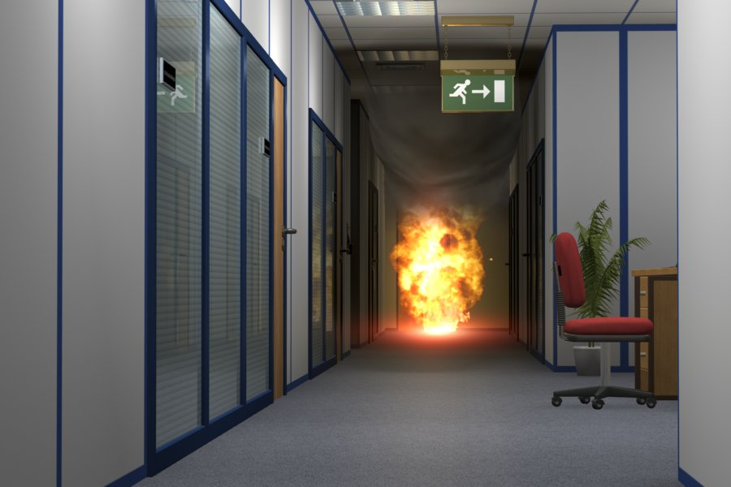
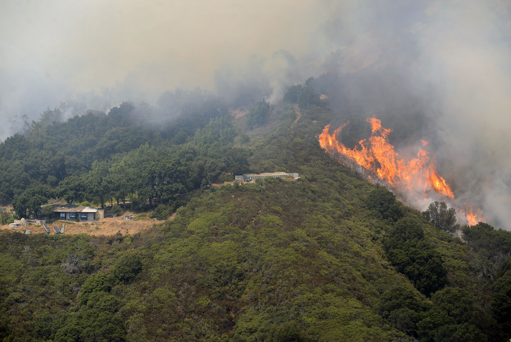
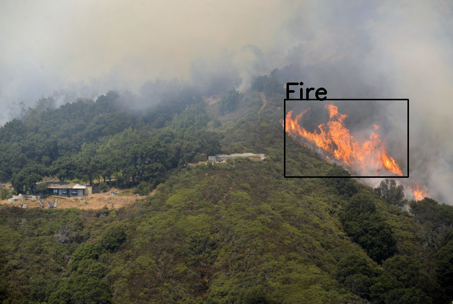
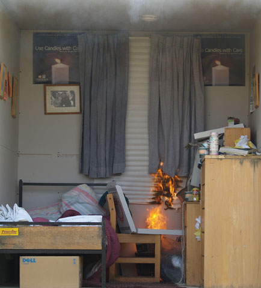
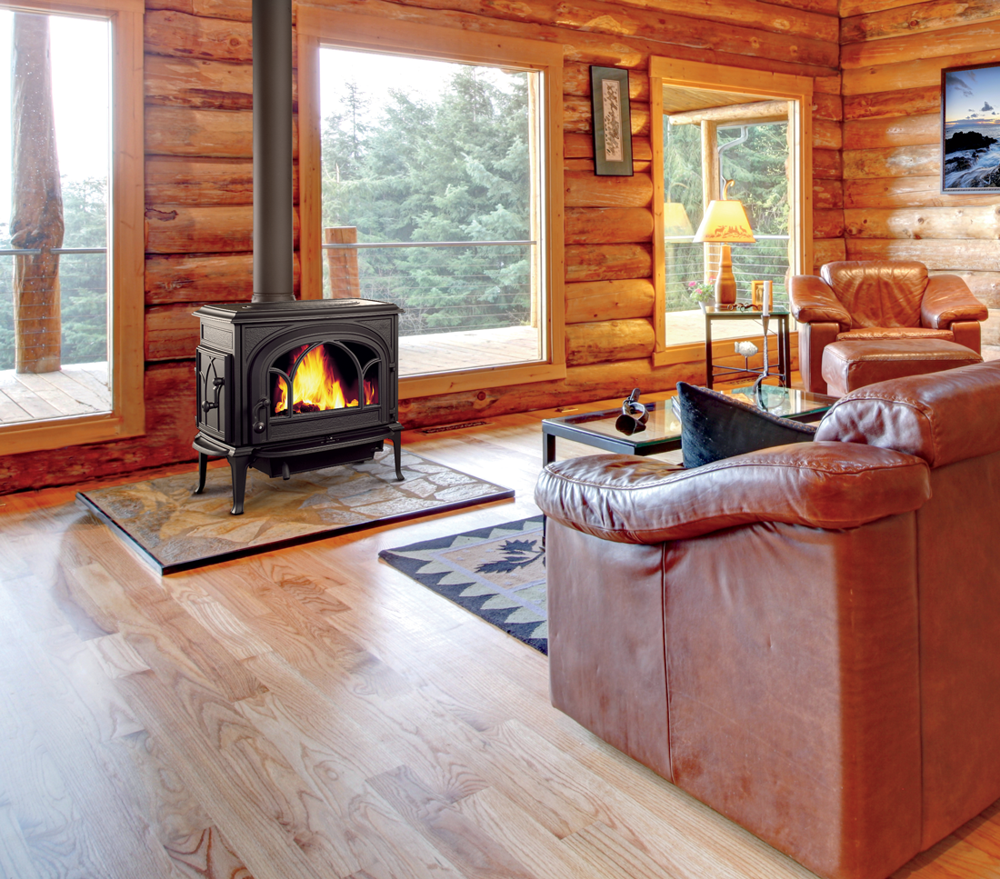

# Ignision
A Computer Vision based project relying on object detection and localization to detect the presence of fire in an image and display its location.
## Dataset
The images and XML annotations are sourced from the  [Fire Data Annotations Image Dataset version 5](https://universe.roboflow.com/fire-detection/fire-data-annotations/dataset/5) which was released on Jul 6, 2022, and is available on **roboflow**.

## Model
### Environment Setup

<pre>
<code class="language-bash">
python -m venv env_name #Create a virtual env named env_name
env_name\Scripts\activate #For Windows: Activate the virtual env
pip install -r Ignision/requirements.txt #Download the required libraries
</code>
</pre>
##### Note: Download the ['weights.h5'](https://drive.google.com/drive/folders/1e9YafLoB9IHpa0aY33fx_l-_ztxoUM7u) file from the provided Google Drive link.

### Train
<pre>
<code class="language-bash">
python -m Ignision --train --learning-rate=1e-4 --epochs=4 --save-best-to="newweights.h5" --checkpoint-dir="checkpoint.h5" --load-from="Ignision\weights.h5" --dropout=0.2
#These parameters are merely exemplary; adjust them according to your requirements.
</code>
</pre>

### Predictions
There are two ways to run predictions on images:

1. `--predict`: Predicting and displaying results
2. `--predict-to-file`:Predicting and writing results to an image file named `pred.png`
<pre>
<code class="language-bash">
python -m Ignision --predict="file_path" --load-from="Ignision\weights.h5"
python -m Ignision --predict-to-file="file_path" --load-from="Ignision\weights.h5"
</code>
</pre>
## Results
&nbsp;&nbsp;&nbsp;&nbsp;
 
 
 
&nbsp;&nbsp;&nbsp;&nbsp;
 
 
 
&nbsp;&nbsp;&nbsp;&nbsp;
 
 
 
&nbsp;&nbsp;&nbsp;&nbsp;
 
 
 
&nbsp;&nbsp;&nbsp;&nbsp;
 
